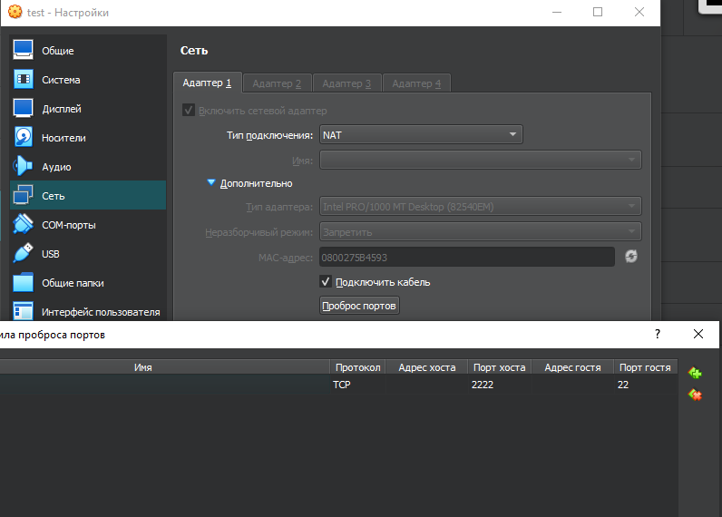

# Установка gitlab-runner (task1)

``` 
sudo curl -L --output /usr/local/bin/gitlab-runner "https://gitlab-runner-downloads.s3.amazonaws.com/latest/binaries/gitlab-runner-linux-amd64"
```

``` 
sudo chmod +x /usr/local/bin/gitlab-runner
```

``` 
sudo useradd --comment 'GitLab Runner' --create-home gitlab-runner --shell /bin/bash
```

``` 
sudo gitlab-runner install --user=gitlab-runner --working-directory=/home/gitlab-runner
```

После установки необходимо зарегистрировать gitlab-runner

- sudo gitlab-runner register
-  url - https://repos.21-school.ru
- registration token - токен со страницы проекта 
- description - do6_cicd
- tags - build, style, test, deploy
- options - -
- executor - shell


# Инициализация папки и клонирование репозетория

1) Перейдем в папку **gitlab-runner**, у меня она по пути **/home/gitlab-runner/**

- p.s для того чтобы нормально работать с папкой **gitlab-runner**, лучше всего зайти под root 
- p.s.s - тут можно сделать проще, просто переключиться на пользователя sudo su gitlab-runner (не надо делать такие задания в 4-5 утра)
``` 
sudo su
```
2) Инициализируем эту папку как безопасную для работы с git

``` 
sudo git init
sudo chmod -R u+rw /home/gitlab-runner
sudo git config --global --add safe.directory /home/gitlab-runner
sudo git config --global user.email "agathaze@student.21-school.ru"
sudo git config --global user.name "agathaze"
```

3) Для клонирования репозетория я использовал HTTPS и токен

- p.s  токен генерируется в **edit profile-access tokens**, он будет использоваться вместо пароля 

4) Дальше просто клонируем репу и переключаемся на ветку **develop**


# Перенос файлов

Тут у нас есть 2 пути:

1) Если работаешь дома, то смело ставь адаптер **Сетевой мост** и настраивай netplan


После чего пишешь **scp /путь/к/файлу username@виртуальная_машина:/путь/назначения**

Для моей машины 
``` 
scp -r D:/Загрузки/C3_SimpleBashUtils-2-develop-src user@192.168.0.66:/home/user

```
Дальше просто скопируй папку под root в **/home/gitlab-runner**

2) Если работаешь в школе, то тут только NAT 
- настраиваем netplan


- выключаем виртуальную машину и заходим в ее настройки



- должно поолучится как-то так, а теперь тестируем соединение


- для подключения используем **ssh user@localhost -p 2222**


# Сборка(task2)

- тебе необходимо добавить файл **gitlab-ci.yml**, это можно сделать 2 способами:
1) создать файл внутри виртуальной машины, в корне проекта
2) Использовать GUI(мой вариант)

- для этогоо переходи в ci/cd в gitlab, жми editors
- ps не забудь переключить ветку


### Конфигурация gitlab-ci.yml

``` 
stages:          # List of stages for jobs, and their order of execution
  - build

build-job:      # This job runs in the build stage, which runs first.
  stage: build
  tags:
     - build 
  script:
    - echo "build..."
    - cd src/cat/ && make s21_cat
    - cd ../grep/ && make s21_grep
    - echo "build finished"
```

1) stages: Это список "стадий" или "фаз", которые определяют порядок выполнения различных работ (jobs) в процессе CI/CD. В данном примере определены  стадии: **build**
2) build-job: Это определение конкретной работы, которая выполняется на стадии build. Каждая работа состоит из набора команд, которые выполняются в определенной среде или "раннере"
3) stage: build: Эта строку указывает, что build-job принадлежит к стадии build
4) tags: Теги используются для выбора конкретных раннеров (исполнителей) для выполнения работы. В данном случае, тег build может быть использован для того, чтобы эта работа выполнялась только раннерами, которые специально настроены для сборки проекта.
5) script: Это команды, которые выполняются в рамках build-job.


- коммитим изменения 


- как видим, что стадия сборки прошла


- добавим сохранение артефактов

- артефакты (artifacts) – это файлы, которые генерируются в результате сборки проекта или выполнения задач (jobs). это могут быть скомпилированные версии программ, библиотеки, документация, логи, тестовые отчёты, архивы для развертывания и любые другие файлы, которые должны быть сохранены после выполнения задачи.

```
 stages:          # List of stages for jobs, and their order of execution
  - build

build-job:      # This job runs in the build stage, which runs first.
  stage: build
  tags:
     - build 
  script:
    - echo "build..."
    - cd src/cat/ && make s21_cat
    - cd ../grep/ && make s21_grep
    - echo "build finished"

  artifacts:
    paths:
      - src/cat/s21_cat
      - src/grep/s21_grep
    expire_in: 30 days
```


- мы получили наши артефакты(исполняемые файлы)


# Code-style(task3)

- добавим в наш **gitlab-ci.yml**

``` 
stages:
  - code-style         
  - build


code-style-job:
  stage: code-style
  tags:
    - style
  script:
    - echo "code-style in progress..."
    - cd src/cat/ && clang-format -n -style=google *.c *.h
    - cd ../grep/ && clang-format -n -style=google *.c *.h
    - echo "code-style finished"
```
- ps у вертера code-style идет перед сборкой, поэтому code-style идет первой


- ну что стадия проошла успешно, а это значит что с code-style все хорошо 


# Интеграционные тесты(task4)

Перейдем к самому интересному, и так для этого потребуется изменить наш **gitlab-ci.yml**

``` 
stages:
  - code-style         
  - build
  - test


code-style-job:
  stage: code-style
  tags:
    - style
  script:
    - echo "code-style in progress..."
    - cd src/cat/ && clang-format -n -style=google *.c *.h
    - cd ../grep/ && clang-format -n -style=google *.c *.h
    - echo "code-style finished"
  
build-job:      
  stage: build
  tags:
     - build 
  script:
    - echo "build..."
    - cd src/cat/ && make s21_cat
    - cd ../grep/ && make s21_grep
    - echo "build finished"
  artifacts:
    paths:
      - src/cat/s21_cat
      - src/grep/s21_grep
    expire_in: 30 days


cat-test-job:
    stage: test
    tags:
      - build

    script:
      - echo "start integrate tests for cat"
      - cd src/cat/ && bash test.sh || exit 1
  
  
grep-test-job:
    stage: test
    tags:
      - build

    script:
      - echo "start integrate tests for grep"
      - cd src/grep/ && bash tests_grep.sh || exit 1
  
```

Добавим в наши тесты услвие, что если FAIL больше 0, то зафейлить pipeline

```
if [ "$FAIL" -gt 0 ];
then
     exit 1
else
     exit 0
fi
```


Как видим, зафейлилась **job** которая проверяет grep


- ps условие на fail было добалено только в grep, ибо тесты написаны под школьный мак

Теперь перепиши условие так, чтобы если проходило больше 50%, то pipeline не фейлился, для этого добавь в тесты условие:

```
HALF=$((COUNTER / 2))


if [ "$SUCCESS" -gt "$HALF" ];
then
            exit 0
    else
                exit 1
fi
```
- ps соре из vim копируется только так

Пушим изменения и смотрим 


Все стадии успешно пройдены 


# Этап деплоя(task5)

Итак, на этом этапе нам понадобится поднять еще одну машину, тут 2 варианта

1) Если работаешь из дома, то просто поднимай 2 виртуалку и простоо продолжай настроойку
2) Если ты работаешь в школе, то используй внутреннюю сеть

Дальше необходимо отключить проверку на **FingerPrint**(то самое сообщение с "yes or no")

Для этого на 2х машинах зайди в **sudo vim /etc/ssh/ssh_config** и поменяй строку **HostbasedAuthentication**

```
Include /etc/ssh/ssh_config.d/*.conf

Host *
#   ForwardAgent no
#   ForwardX11 no
#   ForwardX11Trusted yes
#   PasswordAuthentication yes
   HostbasedAuthentication no
#   GSSAPIAuthentication no
#   GSSAPIDelegateCredentials no
#   GSSAPIKeyExchange no
#   GSSAPITrustDNS no
#   BatchMode no
#   CheckHostIP yes
#   AddressFamily any
#   ConnectTimeout 0
#   StrictHostKeyChecking ask
#   IdentityFile ~/.ssh/id_rsa
#   IdentityFile ~/.ssh/id_dsa
#   IdentityFile ~/.ssh/id_ecdsa
#   IdentityFile ~/.ssh/id_ed25519
#   Port 22
#   Ciphers aes128-ctr,aes192-ctr,aes256-ctr,aes128-cbc,3des-cbc
#   MACs hmac-md5,hmac-sha1,umac-64@openssh.com
#   EscapeChar ~
#   Tunnel no
#   TunnelDevice any:any
#   PermitLocalCommand no
#   VisualHostKey no
#   ProxyCommand ssh -q -W %h:%p gateway.example.com
#   RekeyLimit 1G 1h
    SendEnv LANG LC_*
    HashKnownHosts yes
    GSSAPIAuthentication yes
Host 192.168.0.*
        StrictHostKeyChecking no
```
PS не забудь написать ``` sudo systemctl restart sshd```

P.S.S не забудь написать строку ```Host 192.168.0.*``` проосто задает диапазон ip адресов, на которые распространяется это правило


### Дальше необходимо отключить пароль, в этом нам помогут rsa ключи

1) На машине где установлен gitlab-runner, выполни команды:

``` 
ssh-keygen -t rsa -b 4096 -N "" -f ~/.ssh/id_rsa

```
``` 
ssh-copy-id user@192.168.0.18

```

P.S  не забудь поменять ip


После чего тебе необходимо написать скрипт, который будет перемещать артефакты

```
#!/bin/bash

REMOTE_HOST="192.168.0.18"
REMOTE_USER="user"
REMOTE_DIR="/usr/local/bin"


PATH_1="/home/gitlab-runner/builds/Px5du6p_/0/students/DO6_CICD.ID_356283/agathaze_student.21_school.ru/DO6_CICD-1/src/cat/s21_cat"
PATH_2="/home/gitlab-runner/builds/Px5du6p_/0/students/DO6_CICD.ID_356283/agathaze_student.21_school.ru/DO6_CICD-1/src/grep/s21_grep"

# Копирование файлов на удалённый сервер
scp -o StrictHostKeyChecking=no $PATH_1 $PATH_2 $REMOTE_USER@$REMOTE_HOST:/tmp

# Проверка на наличие ошибок при копировании
if [ $? -ne 0 ]; then
            echo "Ошибка при копировании файлов"
                exit 1
fi

# Перемещение файлов в целевую директорию на удалённом сервере
ssh -o StrictHostKeyChecking=no $REMOTE_USER@$REMOTE_HOST "mv /tmp/s21_cat $REMOTE_DIR; mv /tmp/s21_grep $REMOTE_DIR"

# Проверка на наличие ошибок при перемещении
if [ $? -ne 0 ]; then
            echo "Ошибка при перемещении файлов"
                exit 1
fi

# Сообщение об успешной операции
echo "Файлы успешно скопированы/перемещены"

```

А еще переписать наш **gitlab-ci.yml**

``` 
stages:
  - code-style         
  - build
  - test
  - deploy


code-style-job:
  stage: code-style
  tags:
    - style
  script:
    - echo "code-style in progress..."
    - cd src/cat/ && clang-format -n -style=google *.c *.h
    - cd ../grep/ && clang-format -n -style=google *.c *.h
    - echo "code-style finished"
  
build-job:      
  stage: build
  tags:
     - build 
  script:
    - echo "build..."
    - cd src/cat/ && make s21_cat
    - cd ../grep/ && make s21_grep
    - echo "build finished"
  artifacts:
    paths:
      - src/cat/s21_cat
      - src/grep/s21_grep
    expire_in: 30 days


cat-test-job:
    stage: test
    tags:
      - build

    script:
      - echo "start integrate tests for cat"
      - cd src/cat/ && bash test.sh || exit 1
  
  
grep-test-job:
    stage: test
    tags:
      - build

    script:
      - echo "start integrate tests for grep"
      - cd src/grep/ && bash tests_grep.sh || exit 1
  

deploy-job:
  stage: deploy
  tags:
    - depploy

  script:
    - chmod 777 src/deploy.sh
    - bash src/deploy.sh
  
  when: manual
```


Как видишь, появилась возможность запустить стадию в ручном режиме 

После его запуска получим 


Для решения этой проблемы выполним (если сейчас под обычным **user**, а не под **root**)

`` 
sudo su gitlab-runner
``

Затем 

``` 
ssh-keygen
```
``` 
ssh-copy-id user@192.168.0.18
```

И обязательно пробуем подключится

```
ssh user@192.168.0.18
```

- p.s убедись что ты под пользователем gitlab-runner


- как видишь, что все прошло успешно 


# Уведомления(task6)


1) Создай бота, для этого в tg найди ``@BotFather`` и следуй инструкциям


2) Проверь бота по его имени, у мменя это ``@agathaze_bot``


3) Дальше тебе нужно написать скрипт, который запустит бота 

``` 
#!/bin/bash

STAGE=$1
CHAT_ID="387888779"
BOT_TOKEN="6993236110:AAFyUbJ1hXfIOl3nqSrbeyR9hcO9qwShBcY"

sleep 5

if [ "$CI_JOB_STATUS" == "success" ]; then
    MESSAGE="Stage $STAGE -> $CI_JOB_NAME done successfully! $CI_PROJECT_URL/pipelines"
else
    MESSAGE="Stage $STAGE -> $CI_JOB_NAME failed! $CI_PROJECT_URL/pipelines"
fi

curl -X POST "https://api.telegram.org/bot$BOT_TOKEN/sendMessage" -d chat_id=$CHAT_ID -d text="$MESSAGE"
```

- p.s чтобы узнать id чата, необходимо перейти по ``https://api.telegram.org/bot<yourbottoken>/getupdates``   и найти поле **chat_id** 

4) Добавь в свой **gitlab-ci.yml** файл запуск бота

``` 
stages:
  - code-style         
  - build
  - test
  - deploy


code-style-job:
  stage: code-style
  tags:
    - style
  script:
    - echo "code-style in progress..."
    - cd src/cat/ && clang-format -n -style=google *.c *.h
    - cd ../grep/ && clang-format -n -style=google *.c *.h
    - git diff --exit-code
    - echo "code-style finished"
  
  after_script:
    - chmod 777 src/bot.sh
    - bash src/bot.sh ci
  
build-job:      
  stage: build
  tags:
     - build 
  script:
    - echo "build..."
    - cd src/cat/ && make s21_cat
    - cd ../grep/ && make s21_grep
    - echo "build finished"
  
  artifacts:
    paths:
      - src/cat/s21_cat
      - src/grep/s21_grep
    expire_in: 30 days
  
  after_script:
    - chmod 777 src/bot.sh
    - bash src/bot.sh ci


cat-test-job:
    stage: test
    tags:
      - build

    script:
      - echo "start integrate tests for cat"
      - cd src/cat/ && bash test.sh || exit 1
  
    after_script:
      - chmod 777 src/bot.sh
      - bash src/bot.sh ci
  
grep-test-job:
    stage: test
    tags:
      - build

    script:
      - echo "start integrate tests for grep"
      - cd src/grep/ && bash tests_grep.sh || exit 1

    after_script:
    - chmod 777 src/bot.sh
    - bash src/bot.sh ci

deploy-job:
  stage: deploy
  tags:
      - deploy
  
  script:
    - chmod 777 src/deploy.sh
    - bash src/deploy.sh
  
  after_script:
    - chmod 777 src/bot.sh
    - bash src/bot.sh cd
  
  when: manual
```

Запусти **Pipeline**   и проверь чат с ботом


- как видим, все стадии прошли успешно 